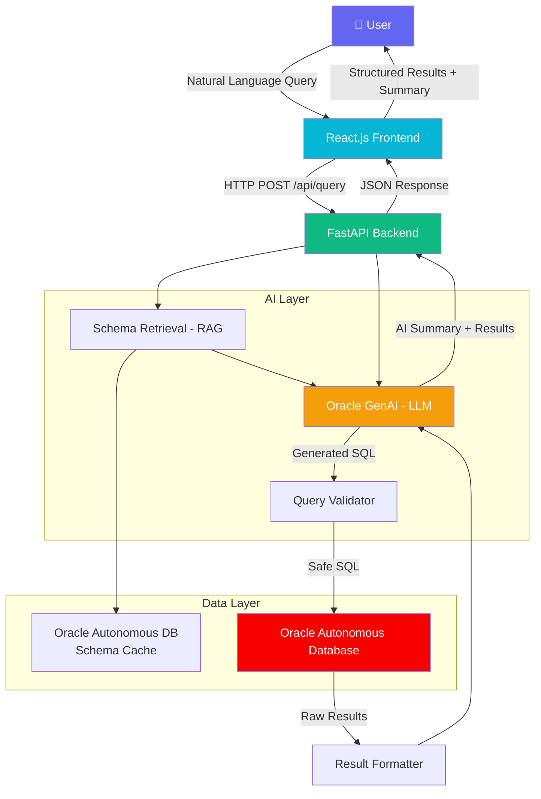

<div align="center">

# 🔮 Oracle AI Query Agent

### *Ask your database anything — in plain English.*

[](https://python.org)
[](https://fastapi.tiangolo.com)
[](https://react.dev)
[](https://vitejs.dev)
[](https://tailwindcss.com)
[](https://www.oracle.com/autonomous-database/)
[](LICENSE)

<br/>

> **Query your Oracle Database the way you think — not the way SQL demands.**  
> Powered by Oracle Generative AI, RAG, and a schema-aware Text-to-SQL pipeline.

<br/>


<!-- Replace with actual screenshot -->

</div>

---

## 📋 Table of Contents

- [Project Description](#-project-description)
- [Problem Statement](#-problem-statement)
- [Solution Overview](#-solution-overview)
- [System Architecture](#-system-architecture)
- [Key Features](#-key-features)
- [Technology Stack](#-technology-stack)
- [Project Structure](#-project-structure)
- [Installation](#-installation)
- [Environment Variables](#-environment-variables)
- [Running the Application](#-running-the-application)
- [Oracle Database Configuration](#-oracle-database-configuration)
- [API Endpoints](#-api-endpoints)
- [Example Queries](#-example-queries)
- [Screenshots](#-screenshots)
- [Future Enhancements](#-future-enhancements)
- [Contributors](#-contributors)
- [License](#-license)

---

## 📖 Project Description

**Oracle AI Query Agent** is a full-stack, AI-powered application that acts as an intelligent bridge between human language and structured database queries. Users can type natural language questions into a conversational dashboard, and the system automatically generates, validates, and executes the corresponding SQL against an Oracle Autonomous Database — returning both structured results and an AI-generated plain-English summary.

This project was built to democratise data access: no SQL knowledge required, no training needed, and no barriers between a business user and their data.

---

## ❗ Problem Statement

Organisations hold vast amounts of structured data in relational databases, yet the majority of business users — analysts, managers, operations teams — cannot write SQL. This creates a bottleneck:

- **Data teams are overwhelmed** with ad-hoc query requests from non-technical stakeholders.
- **Business users are blocked** from getting timely answers, slowing decision-making.
- **Self-service BI tools** are powerful but still require learning query logic or drag-and-drop interfaces.
- **Existing chatbots** lack deep schema awareness and hallucinate incorrect SQL, producing wrong or broken queries.

The result: data exists, but insight is delayed, gatekept, or simply never reached.

---

## ✅ Solution Overview

Oracle AI Query Agent solves this by combining three powerful capabilities into a single, user-friendly interface:

| Capability | What it does |
|---|---|
| 🧠 **Text-to-SQL Translation** | Converts plain English questions into syntactically correct, schema-aware SQL using Oracle GenAI |
| 🗄️ **Oracle DB Integration** | Executes validated queries securely against Oracle Autonomous Database |
| 💬 **Conversational Analytics** | Supports multi-turn follow-up questions with session memory and context retention |
| 📊 **AI Result Summarisation** | Explains query results in plain English, making data accessible to non-technical users |
| 🔍 **Query Explanation** | Breaks down the generated SQL in human-readable terms for transparency and trust |

---

## 🏗️ System Architecture



### Request Flow

```
User Input
    │
    ▼
┌─────────────────────────────────────────────┐
│              React Dashboard                │
│   (Query Input → Results Table → Summary)  │
└────────────────────┬────────────────────────┘
                     │ REST API
                     ▼
┌─────────────────────────────────────────────┐
│              FastAPI Backend                │
│  ┌──────────┐  ┌───────────┐  ┌─────────┐  │
│  │  Schema  │  │  GenAI    │  │  Query  │  │
│  │   RAG    │→ │ Text-SQL  │→ │  Exec   │  │
│  └──────────┘  └───────────┘  └─────────┘  │
└─────────────────────────────────────────────┘
                     │
                     ▼
┌─────────────────────────────────────────────┐
│         Oracle Autonomous Database          │
│         (Secure · Managed · Scalable)       │
└─────────────────────────────────────────────┘
```

---

## ✨ Key Features

### 🗣️ Natural Language to SQL Translation
Type questions in plain English. The system uses Oracle Generative AI with a schema-aware prompt to generate accurate, dialect-correct Oracle SQL — handling JOINs, aggregations, date arithmetic, and filters automatically.

### 🗄️ Oracle Database Integration
Native connection to **Oracle Autonomous Database** via `oracledb` (python-oracledb). Supports wallet-based TLS authentication for secure cloud connectivity.

### 🧩 Schema-Aware Query Generation (RAG)
A **Retrieval-Augmented Generation** pipeline injects relevant table schema, column names, and data types into the LLM prompt — reducing hallucinations and dramatically improving SQL accuracy.

### 🛡️ Secure Query Validation & Execution
All generated SQL is validated before execution. Destructive statements (`DROP`, `DELETE`, `TRUNCATE`, `INSERT`, `UPDATE`) are blocked. Only read-only `SELECT` queries are permitted.

### 🔄 Conversational Multi-Turn Querying
Follow-up questions like *"Now show me the same data for Q3"* or *"Break that down by region"* are handled with session-level conversation memory.

### 📝 AI-Powered Result Summarisation
Raw tabular results are passed back to the LLM, which produces a concise, jargon-free summary highlighting key trends, totals, and anomalies.

### 🔍 Query Explanation for Non-Technical Users
Every generated SQL query comes with a step-by-step plain-English explanation — building user trust and data literacy simultaneously.

### 🖥️ Modern React Dashboard
A clean, responsive Vite + React + Tailwind UI with a query input panel, real-time results table, conversation history, and copy/export functionality.

### ⚡ FastAPI Backend
A high-performance async Python backend with structured JSON responses, error handling, and modular routing.

---

## 🛠️ Technology Stack

### Frontend

| Technology | Version | Purpose |
|---|---|---|
| [React.js](https://react.dev) | 18+ | UI framework |
| [Vite](https://vitejs.dev) | 5+ | Build tool & dev server |
| [Tailwind CSS](https://tailwindcss.com) | 3+ | Utility-first styling |
| Axios | Latest | HTTP client for API calls |

### Backend

| Technology | Version | Purpose |
|---|---|---|
| [Python](https://python.org) | 3.11+ | Core runtime |
| [FastAPI](https://fastapi.tiangolo.com) | 0.110+ | REST API framework |
| [Uvicorn](https://www.uvicorn.org) | Latest | ASGI server |
| [python-oracledb](https://python-oracledb.readthedocs.io) | Latest | Oracle DB driver |
| [LangChain](https://langchain.com) *(optional)* | Latest | LLM orchestration |

### AI & Data

| Technology | Purpose |
|---|---|
| [Oracle Generative AI](https://www.oracle.com/artificial-intelligence/generative-ai/) | LLM for Text-to-SQL and summarisation |
| RAG (Retrieval-Augmented Generation) | Schema-aware prompt construction |
| Oracle Autonomous Database | Managed cloud database |

---

## 📁 Project Structure

```
oracle-ai-query-agent/
│
├── 📂 frontend/                    # React + Vite application
│   ├── 📂 public/
│   ├── 📂 src/
│   │   ├── 📂 components/
│   │   │   ├── QueryInput.jsx      # Natural language input component
│   │   │   ├── ResultsTable.jsx    # Tabular results display
│   │   │   ├── SummaryCard.jsx     # AI summary panel
│   │   │   ├── QueryExplainer.jsx  # SQL explanation panel
│   │   │   └── ConversationHistory.jsx
│   │   ├── 📂 pages/
│   │   │   └── Dashboard.jsx
│   │   ├── 📂 services/
│   │   │   └── api.js              # Axios API service layer
│   │   ├── App.jsx
│   │   └── main.jsx
│   ├── index.html
│   ├── vite.config.js
│   ├── tailwind.config.js
│   └── package.json
│
├── 📂 backend/                     # FastAPI application
│   ├── 📂 app/
│   │   ├── main.py                 # FastAPI entry point
│   │   ├── 📂 routers/
│   │   │   ├── query.py            # /api/query endpoint
│   │   │   ├── schema.py           # /api/schema endpoint
│   │   │   └── health.py           # /api/health endpoint
│   │   ├── 📂 services/
│   │   │   ├── nlp_to_sql.py       # Text-to-SQL translation service
│   │   │   ├── oracle_db.py        # Oracle DB connection & execution
│   │   │   ├── rag_service.py      # Schema RAG pipeline
│   │   │   ├── summariser.py       # AI result summarisation
│   │   │   └── validator.py        # SQL safety validation
│   │   ├── 📂 models/
│   │   │   └── schemas.py          # Pydantic request/response models
│   │   └── 📂 config/
│   │       └── settings.py         # Environment config (pydantic-settings)
│   ├── requirements.txt
│   └── .env.example
│
├── 📂 assets/
│   └── 📂 screenshots/             # README screenshots
│
├── .gitignore
├── LICENSE
└── README.md
```

---

## 🚀 Installation

### Prerequisites

Ensure the following are installed on your system:

| Requirement | Version | Check |
|---|---|---|
| Python | 3.11+ | `python --version` |
| Node.js | 18+ | `node --version` |
| npm | 9+ | `npm --version` |
| Oracle Instant Client | 21+ | [Download here](https://www.oracle.com/database/technologies/instant-client.html) |
| Git | Any | `git --version` |

### 1. Clone the Repository

```bash
git clone https://github.com/<your-username>/oracle-ai-query-agent.git
cd oracle-ai-query-agent
```

### 2. Backend Setup

```bash
# Navigate to backend
cd backend

# Create and activate a virtual environment
python -m venv venv

# On Linux/macOS:
source venv/bin/activate

# On Windows:
venv\Scripts\activate

# Install dependencies
pip install -r requirements.txt
```

### 3. Frontend Setup

```bash
# Navigate to frontend
cd ../frontend

# Install Node dependencies
npm install
```

---

## 🔐 Environment Variables

Copy the example file and populate with your credentials:

```bash
cp backend/.env.example backend/.env
```

Edit `backend/.env`:

```env
# ── Oracle Database ──────────────────────────────────────────
ORACLE_USER=your_db_username
ORACLE_PASSWORD=your_db_password
ORACLE_DSN=your_autonomous_db_dsn         # e.g. mydb_high
ORACLE_WALLET_DIR=/path/to/wallet         # Path to unzipped wallet folder
ORACLE_WALLET_PASSWORD=your_wallet_pass

# ── Oracle Generative AI ─────────────────────────────────────
OCI_CONFIG_FILE=~/.oci/config             # Path to OCI config file
OCI_COMPARTMENT_ID=ocid1.compartment...   # Your OCI compartment OCID
OCI_GENAI_MODEL_ID=cohere.command-r-plus  # Or your preferred model
OCI_GENAI_ENDPOINT=https://inference.generativeai.us-chicago-1.oci.oraclecloud.com

# ── Application ──────────────────────────────────────────────
APP_ENV=development
APP_HOST=0.0.0.0
APP_PORT=8000
CORS_ORIGINS=http://localhost:5173

# ── RAG / Schema Config ──────────────────────────────────────
SCHEMA_CACHE_TTL=3600                     # Schema cache TTL in seconds
MAX_SCHEMA_TABLES=50                      # Max tables to include in RAG context
```

> ⚠️ **Never commit your `.env` file.** It is listed in `.gitignore` by default.

---

## ▶️ Running the Application

### Run the Backend

```bash
cd backend

# Activate virtual environment if not already active
source venv/bin/activate  # Linux/macOS

# Start FastAPI with Uvicorn
uvicorn app.main:app --host 0.0.0.0 --port 8000 --reload
```

Backend will be available at: `http://localhost:8000`  
Interactive API docs: `http://localhost:8000/docs`

### Run the Frontend

```bash
cd frontend

# Start Vite development server
npm run dev
```

Frontend will be available at: `http://localhost:5173`

### Run Both (Concurrent — Linux/macOS)

```bash
# From project root
cd backend && source venv/bin/activate && uvicorn app.main:app --reload &
cd frontend && npm run dev
```

---

## 🗄️ Oracle Database Configuration

### 1. Oracle Autonomous Database Wallet

1. Download the **Instance Wallet** from your OCI Console → Autonomous Database → **DB Connection**.
2. Unzip it to a secure local directory (e.g. `/opt/oracle/wallet/`).
3. Set `ORACLE_WALLET_DIR` in your `.env` to this path.

### 2. OCI Configuration

Ensure your `~/.oci/config` is correctly set up for Generative AI access:

```ini
[DEFAULT]
user=ocid1.user.oc1..xxxxx
fingerprint=xx:xx:xx:xx:xx
tenancy=ocid1.tenancy.oc1..xxxxx
region=us-chicago-1
key_file=~/.oci/oci_api_key.pem
```

### 3. Required Oracle DB Permissions

```sql
-- Grant read access for schema introspection
GRANT SELECT ANY DICTIONARY TO your_db_user;
GRANT SELECT ON your_schema.* TO your_db_user;
```

### 4. Supported Data Types

The system handles Oracle-specific types including `DATE`, `TIMESTAMP`, `NUMBER`, `VARCHAR2`, `CLOB`, and `BLOB` metadata (previews only).

---

## 📡 API Endpoints

| Method | Endpoint | Description |
|---|---|---|
| `POST` | `/api/query` | Submit a natural language query |
| `GET` | `/api/schema` | Retrieve available table schemas |
| `POST` | `/api/explain` | Explain a generated SQL query |
| `POST` | `/api/conversation` | Submit a follow-up query with context |
| `DELETE` | `/api/conversation/{session_id}` | Clear a conversation session |
| `GET` | `/api/health` | Health check |

### POST `/api/query`

**Request Body:**
```json
{
  "question": "What were the total sales in the UK region last quarter, broken down by product category?",
  "session_id": "optional-session-uuid"
}
```

**Response:**
```json
{
  "session_id": "abc-123-xyz",
  "question": "What were the total sales in the UK region last quarter, broken down by product category?",
  "sql": "SELECT PRODUCT_CATEGORY, SUM(SALE_AMOUNT) AS TOTAL_SALES FROM SALES WHERE REGION = 'UK' AND SALE_DATE >= ADD_MONTHS(TRUNC(SYSDATE, 'Q'), -3) AND SALE_DATE < TRUNC(SYSDATE, 'Q') GROUP BY PRODUCT_CATEGORY ORDER BY TOTAL_SALES DESC",
  "explanation": "This query totals sales amounts grouped by product category, filtered to the UK region and the calendar quarter prior to today.",
  "results": [
    { "PRODUCT_CATEGORY": "Electronics", "TOTAL_SALES": 128450.00 },
    { "PRODUCT_CATEGORY": "Clothing",    "TOTAL_SALES": 94320.50 }
  ],
  "summary": "UK sales last quarter totalled £222,770.50 across 2 categories. Electronics led with £128,450 (57.6%), followed by Clothing at £94,320.",
  "row_count": 2,
  "execution_time_ms": 312
}
```

---

## 💬 Example Queries

The system is designed to handle a wide range of business questions:

| Category | Example Query |
|---|---|
| 📊 **Sales Analytics** | *"What were the total sales in the UK region last quarter, broken down by product category?"* |
| 📈 **Trend Analysis** | *"Show me monthly revenue for the past 12 months and highlight any months below target."* |
| 🏆 **Rankings** | *"Which are the top 10 customers by order value this year?"* |
| 🔍 **Filtering** | *"List all orders placed in November that haven't been shipped yet."* |
| 🔄 **Comparisons** | *"Compare this quarter's performance to the same quarter last year by region."* |
| 📦 **Inventory** | *"Which products are running low on stock and need to be reordered?"* |
| 👤 **HR / Operations** | *"How many employees joined each department in the last 6 months?"* |
| 🔁 **Follow-ups** | *"Now filter that to only include the North region."* *(multi-turn)* |

---

## 📸 Screenshots

> *Replace the placeholders below with actual screenshots after deployment.*

### Dashboard — Query Input


### Results Table with AI Summary


### SQL Explanation Panel


### Conversation History


---

## 🔮 Future Enhancements

| Enhancement | Description | Priority |
|---|---|---|
| 📊 **Auto Visualisation** | Automatically render charts (bar, line, pie) based on result shape | High |
| 🔐 **Role-Based Access** | Restrict table visibility per user role or department | High |
| 📤 **Export to CSV/Excel** | One-click export of query results | Medium |
| 🧠 **Query Memory** | Save and recall frequently used queries per user | Medium |
| 🌐 **Multi-Database Support** | Extend to PostgreSQL, MySQL, and Snowflake | Medium |
| 📱 **Mobile UI** | Responsive design for tablet and mobile use | Low |
| 🔊 **Voice Input** | Speech-to-text for hands-free querying | Low |
| 🧪 **Query Confidence Score** | Estimate how confident the LLM is in the generated SQL | Medium |
| 📚 **Glossary / Business Terms** | Map business vocabulary to database columns via a glossary layer | High |
| 🔄 **Scheduled Reports** | Run saved queries on a schedule and email results | Low |

---

## 👥 Contributors

| Name | Role | GitHub |
|---|---|---|
| Mageswaran | Full-Stack Developer & ML Engineer | [@mageswaran](https://github.com/mageswaran) |

> Built with ☕, curiosity, and a deep appreciation for making data accessible to everyone.

---

## 📄 License

This project is licensed under the **MIT License** — see the [LICENSE](LICENSE) file for details.

```
MIT License

Copyright (c) 2024 Mageswaran

Permission is hereby granted, free of charge, to any person obtaining a copy
of this software and associated documentation files (the "Software"), to deal
in the Software without restriction...
```

---

<div align="center">

## 🏆 Built for Impact

> *"The best interface between humans and data is human language itself."*

**Oracle AI Query Agent** was built with a clear mission: eliminate the SQL barrier and give every team member — technical or not — direct, conversational access to the data they need to make better decisions, faster.

This project demonstrates the convergence of **Large Language Models**, **Retrieval-Augmented Generation**, and **enterprise-grade Oracle infrastructure** — showing that production-ready, AI-powered data tools don't have to be complex to use.

Whether you're a data analyst tired of writing boilerplate queries, a manager waiting days for reports, or an engineer exploring the frontier of natural language interfaces — this project is for you.

---

[](https://github.com/mageswaran)
[](https://oracle.com)
[](https://fastapi.tiangolo.com)

*Star ⭐ this repo if it helped you — it means a lot!*

</div>
